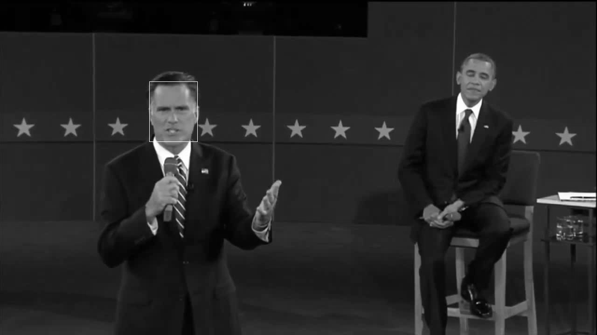

# Introduction
This project is about particle filter tracking. It is done as a part of the [problem set](https://docs.google.com/document/d/1ZGdXBjLgr9U-6wdIgcEyRmDHckJFlyhnSWXK8OsduS4/pub) of CS4495 Introduction to Computer Vision course by Georgia tech. Particle filter tracking initializes particles at random locations, takes a measurement of each one, and finally keeps the ones at locations that are most likely to be correct.

# Usage

To use this code, you need a video and the coordinates of the patch that needs to be tracked. The code can be run as follows:
 ```
 python3 main.py --patch_x --patch_y --patch_width --patch_height --video_filepath [--n_particles] [--dynamic_model] [--alpha] 
 ```

 The preceding command consists of the following elements:
 - ```patch_x``` the x coordinate of the top left corner of the patch to be tracked.
 - ```patch_y``` the y coordinate of the top left corner of the patch to be tracked.
 - ```patch_width``` width of the patch to be tracked
 -  ```patch_height``` height of the patch to be tracked
 - ```video_filepath``` path of the video 
 - ```n_particles``` number of particles to initialize particle filter with
 - ```dynamic_model``` boolean stating whether the appearance model should be updated or kept constant
 - ```alpha``` alpha parameter governing the updates of the appearance model if dynamic_model is True

 # Example output
 - Template
 
 - Output sample
 
 


 
